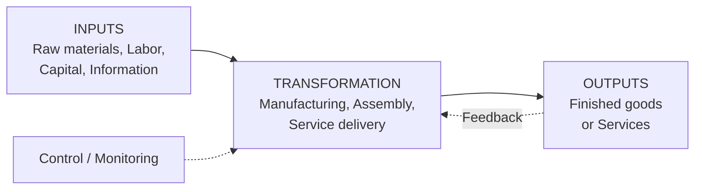
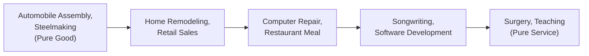
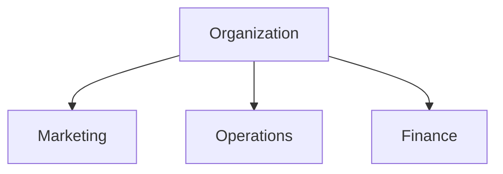
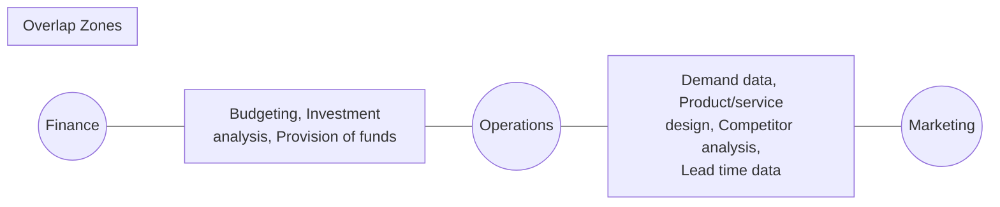
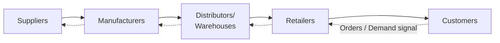
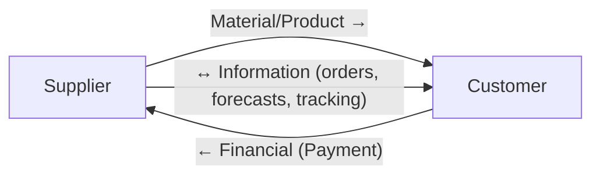
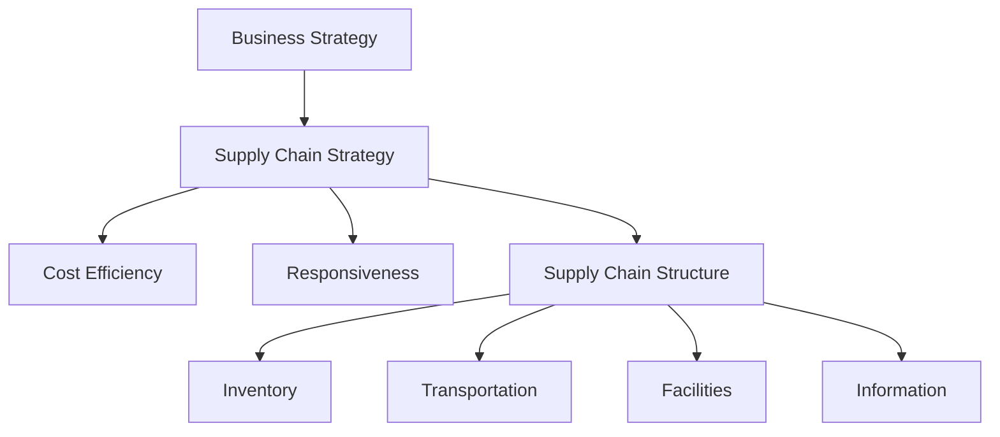
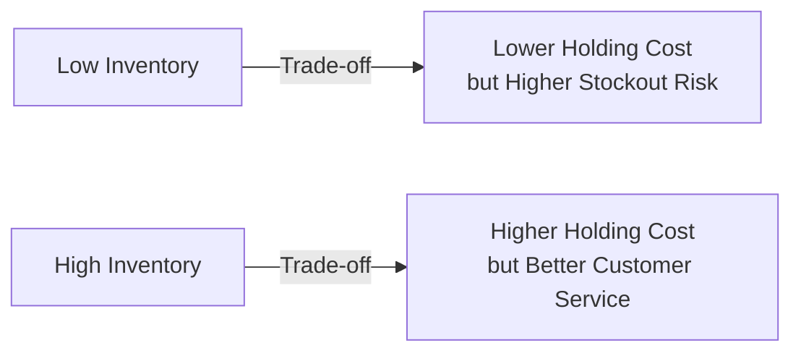

# Operations & Supply Chain Management
## Session 1 & 2 Notes — Introduction to Operations and Supply Chain Management

**Program:** PGDM-BDA | **Term:** 2 | **Faculty:** Dr. Radha Mohan Gupta
**Readings for this session:** WS-1; *Creating a Sustainable Supply Chain* (Tiffany case); Video — *HardRock*

---

## 1. Learning Objectives

By the end of Session 1 & 2, you should be able to:

- Define Operations Management (OM) and distinguish it from other business functions
- Differentiate goods-producing operations from service operations
- Explain why studying OM matters for any manager, not just "operations people"
- Trace the historical evolution of OM
- Describe how operations interrelates with Marketing and Finance
- Identify the categories of decisions operations managers make
- Recognize current issues (globalization, sustainability, ethics, digitalization) shaping OM today
- Define a supply chain, its stages, and the flows that run through it

---

## 2. What Is Operations Management?

**Operations** = the part of an organization responsible for producing goods or delivering services.

**Operations Management (OM)** = the design, planning, and control of the systems that create an organization's goods and services, converting inputs (labor, capital, materials, information) into outputs (products/services) that create value for the customer.

> Simple way to remember it: *OM is the "engine room" of any organization — it turns resources into the value customers actually pay for.*

### The Input–Transformation–Output (ITO) Framework

Every operation, whether a factory or a hospital, can be described using this framework:

**Why the ITO framework matters:**
- Helps visualize the entire flow of an operation
- Facilitates process design and improvement (you can ask: "what if we changed this input?")
- Helps identify **bottlenecks** and inefficiencies — the constraining step that limits overall output

**Worked example — a bakery:**
| Element | Example |
|---|---|
| Input | Flour, yeast, baker's labor, oven (capital) |
| Transformation | Mixing, proofing, baking |
| Output | Bread ready for sale |
| Feedback | Customer complaints about taste → adjust recipe |

**Worked example — a hospital (service):**
| Element | Example |
|---|---|
| Input | Patient, doctors/nurses (labor), equipment, medicines |
| Transformation | Diagnosis, treatment, surgery |
| Output | Treated/discharged patient |
| Feedback | Patient recovery outcomes → refine protocols |

---

## 3. Why Study Operations Management?

Every part of a business affects, or is affected by, operations — even functions that don't look "operational" on the surface:

- **Financial services** — banks "produce" loan approvals, transactions (a service operation)
- **Marketing services** — campaign execution is itself a process that needs to be designed and run efficiently
- **Accounting & Information services** — payroll processing, report generation are operational processes

Studying OM gives you a better understanding of:
1. The world you live in (why products are made where they are made)
2. Global dependencies between companies and nations (e.g., a chip shortage in Taiwan stalling car plants in Germany)
3. Why companies succeed or fail (Toyota's efficiency vs. a competitor's costly recalls)
4. The importance of cross-functional collaboration

**Example:** When Apple launches an iPhone, its success depends as much on **operations decisions** (contract manufacturing in China/India, component sourcing, logistics) as on **marketing/design** — a brilliant product that can't be manufactured or shipped at scale is a failure.

---

## 4. Goods vs. Services

**Goods** are physical, tangible items: automobiles, computers, ovens, shampoo.
**Services** are activities providing time, location, form, or psychological value: air travel, education, a haircut, legal counsel.

### Key Differences

| Dimension | Goods | Services |
|---|---|---|
| Output | Tangible | Intangible |
| Customer contact | Low | High |
| Labor content | Low | High |
| Uniformity of inputs | High (standardized) | Low (varies by customer) |
| Measurement of productivity | Easy | Tedious/difficult |
| Inventory | Can be stored (much) | Cannot be stored (little/none) |

### The Goods–Service Continuum

In reality, almost nothing is a "pure good" or "pure service" — most offerings sit on a spectrum:

**Example to internalize the continuum:** A **restaurant meal** is a hybrid — the food itself is a tangible good, but the ambience, service quality, and experience are intangible service elements. This is why restaurant "operations" must manage both a kitchen (goods-production logic: standardize, batch) and a dining floor (service logic: customer contact, variability).

---

## 5. Scope of Operations Management

The operations function is not confined to the "shop floor" — it spans many interrelated activities across the organization:

- Forecasting
- Capacity planning
- Facilities and layout
- Scheduling
- Managing inventories
- Assuring quality
- Motivating employees
- Deciding where to locate facilities

---

## 6. Basic Functions of a Business Organization

Every organization is fundamentally built on three core functions — **Marketing** (generates demand), **Operations** (fulfills demand), and **Finance** (funds and measures the business). OM cannot be studied in isolation because it constantly overlaps with the other two.

### Function Overlap

**Finance & Operations overlap:**
- Budgeting for new equipment
- Economic analysis of investment proposals (e.g., "should we buy a new machine?")
- Provision of working capital for inventory

**Marketing & Operations overlap:**
- Demand data (marketing forecasts feed capacity/production plans)
- Product and service design (marketing identifies customer needs; operations makes them producible)
- Competitor analysis
- Lead time data (marketing promises delivery dates that operations must be able to meet)

**Example:** When Maruti Suzuki launches a new car variant, Marketing decides features customers want, Finance approves the capital for new tooling, and Operations must redesign the assembly line to produce it — all three functions must align, or the launch fails.

---

## 7. Historical Evolution of Operations Management (context)

While not exhaustively covered in the slides, the discussion of "current issues" implies the historical arc worth noting for context:

- **Craft production** → **Industrial Revolution** (mechanization) → **Scientific Management** (Taylor, division of labor) → **Mass production** (Ford's assembly line) → **Quality revolution** (Deming, TQM, Japan) → **Lean/JIT** (Toyota Production System) → **Globalization & outsourcing** → **Digital/Industry 4.0** (automation, AI, data-driven supply chains)

This evolution explains *why* OM today is inseparable from Supply Chain Management — as firms outsourced and globalized, managing operations *within* one factory was no longer enough; managing the entire chain of partners became essential.

---

## 8. Types of Decisions in Operations Management

### 8.1 System Design Decisions (Strategic)
Long-term, resource-intensive decisions that set the parameters within which the operation will function:
- Capacity
- Facility location
- Facility layout
- Product and service planning
- Acquisition and placement of equipment

### 8.2 System Operation Decisions (Tactical/Operational)
Shorter-term decisions made within the system already designed:
- Management of personnel
- Inventory management and control
- Scheduling
- Project management
- Quality assurance

> **Note:** Operations managers spend *more time* on system operation decisions day-to-day, but they still have a vital stake in system design decisions, since poor design constrains operations for years.

### 8.3 The "5W" OM Decision-Making Framework

| Question | What it addresses |
|---|---|
| **What** | What resources are needed, and in what amounts? |
| **When** | When will each resource be needed? When should work be scheduled/materials ordered? |
| **Where** | Where will the work be done? |
| **How** | How will the product/service be designed? How will work be done? How will resources be allocated? |
| **Who** | Who will do the work? |

**Example:** A hospital opening a new wing must decide: *What* equipment (What), *when* to schedule surgeries (When), *where* to locate the ICU relative to the OT (Where), *how* patient flow will work (How), and *who* staffs each shift (Who).

---

## 9. Introduction to Supply Chain Management (SCM)

### 9.1 What Is a Supply Chain?

A **supply chain** consists of all parties involved, directly or indirectly, in fulfilling a customer request — manufacturers, suppliers, transporters, warehouses, retailers, and **customers themselves**.

Within each organization, the supply chain includes *all* functions involved in receiving and fulfilling a request: new product development, marketing, operations, distribution, finance, and customer service.

> Because the customer is an integral, active part of the chain (placing orders, giving feedback, returning goods), some scholars prefer the terms **"supply network"** or **"supply web"** over "chain" — it's rarely a simple straight line.

### 9.2 Typical Supply Chain Stages

This is a **pull-based supply chain**: customer orders/demand pulls product backward through the chain, while product physically flows forward.

**Example — Automotive Supply Chain:** Steel and component suppliers → auto-parts manufacturers (tier 1/2 suppliers) → OEM assembly plant (e.g., Tata Motors) → regional distribution centers → dealerships → customer. A single car can have 30,000 parts sourced from hundreds of suppliers worldwide — a delay in one microchip supplier (as seen in the global chip shortage of 2021) can halt an entire assembly line.

### 9.3 Structure: Vendor to Customer Flow

### 9.4 The Three Flows in a Supply Chain

A supply chain is not just about moving physical goods — three types of flows move through it, often in different directions:

| Flow type | Direction | Example |
|---|---|---|
| **Material/Product flow** | Supplier → Customer | Raw cotton → fabric → shirt → retail store |
| **Information flow** | Both directions | Customer demand forecasts flow back to suppliers; order confirmations flow forward |
| **Financial flow** | Customer → Supplier (usually) | Payments, credit terms, invoices |

### 9.5 Supply Chain Decisions Framework (by time horizon)

| Level | Time horizon | Examples |
|---|---|---|
| **Strategic** | Long term | Network design, facility location, make-or-buy |
| **Tactical** | Medium term | Aggregate planning, procurement contracts, distribution planning |
| **Operational** | Immediate/short term | Daily scheduling, order fulfillment, routing |

These decisions span the core SCM functional areas: **Procurement, Manufacturing, Logistics, Distribution.**

### 9.6 Supply Chain Strategy — Cost Efficiency vs. Responsiveness

A central strategic trade-off in SCM: every supply chain must position itself somewhere between being **cost-efficient** and being **responsive** to customer needs, and this must align with the overall **business/competitive strategy**.

**Example:**
- **Cost-efficient chain:** A grocery discount chain (e.g., Walmart) optimizes for low cost — large batch shipments, full truckloads, centralized warehousing — accepting slower responsiveness.
- **Responsive chain:** A fast-fashion retailer (e.g., Zara) prioritizes speed of replenishment (2-week design-to-shelf cycle) over lowest possible unit cost, because trends change fast and stockouts are costlier than slightly higher logistics cost.

---

## 10. Why Supply Chain Management Became Necessary

Historically, organizations managed only their **own operations and immediate suppliers** — not the end-to-end chain. This narrow view led to well-documented problems:

- **Oscillating inventory levels** (the "Bullwhip Effect" — small changes in customer demand get amplified as they move upstream through the chain)
- **Inventory stockouts**
- **Late deliveries**
- **Quality problems**

### Key Supply Chain Issues Driving Modern SCM

1. Need to improve operations
2. Increasing levels of outsourcing
3. Increasing transportation costs
4. Competitive pressures
5. Increasing globalization
6. Increasing importance of e-business
7. Growing complexity of supply chains
8. Need to manage inventories effectively

**Example — Bullwhip effect in action:** A retailer sees a 10% spike in demand for a product and orders 20% more "to be safe." The wholesaler, seeing this order, orders 30% more from the manufacturer. The manufacturer ramps up production even further. A small real change in end-customer demand becomes a large, costly swing in production upstream — this is why information sharing across the chain (not just goods movement) is critical.

---

## 11. Current Issues Facing Operations Managers Today

- **Economic conditions** (inflation, interest rates, recessions affecting capacity decisions)
- **Innovating** (staying competitive through new products/processes)
- **Quality problems**
- **Risk management** (supply disruptions, geopolitical risk — e.g., Red Sea shipping disruptions, COVID-19)
- **Competing in a global economy**

### Environmental Concerns & Sustainability

**Sustainability** = using resources in ways that do not harm the ecological systems that support human existence. It goes beyond traditional environmental/economic measures to include **social criteria** (the "Triple Bottom Line": People, Planet, Profit).

Sustainability affects nearly every area of business:
- Product and service design (e.g., biodegradable packaging)
- Consumer education programs
- Disaster preparation and response
- Supply chain waste management
- Outsourcing decisions

> **Connect to your reading:** This is precisely the theme of the *Tiffany & Co. — Creating a Sustainable Supply Chain* case: Tiffany had to redesign its sourcing (responsibly-mined gold, conflict-free diamonds) to align its supply chain with its sustainability commitments — showing that sustainability isn't just a CSR add-on, it is a **supply chain design decision**.

### Ethical Issues in Operations

Ethics touches nearly every operational decision:
- Financial statements (accurate reporting of costs/inventory)
- Worker safety
- Product safety
- Quality
- The environment
- The community
- Hiring and firing workers
- Closing facilities
- Workers' rights

**Example:** A company deciding to close a manufacturing plant and move production overseas to cut cost faces an ethical trade-off between shareholder cost savings and the local community/workforce impact.

---

## 12. Performance Metrics and Trade-offs

Operations managers rely on metrics to manage and control operations:

- Profits
- Costs
- Quality
- Productivity
- Flexibility
- Inventories
- Schedules
- Forecast accuracy

### Understanding Trade-offs

A **trade-off** = giving up one thing in return for something else. Almost no operational decision is "free" — improving one metric typically costs you on another.

**Classic example given in the slides:** Carrying **more inventory** is an expense, but it buys you a **greater level of customer service** (fewer stockouts, faster fulfillment). The operations/supply chain manager's job is to find the *right* balance for the firm's strategy — not to minimize cost or maximize service in isolation.

Other common trade-offs to keep in mind going forward in the course:
- Cost vs. Quality
- Speed/Responsiveness vs. Cost Efficiency (echoes Section 9.6 above)
- Flexibility vs. Standardization/Efficiency

---

## 13. Quick Recap — Key Takeaways

1. **OM** = designing, planning, and controlling the transformation of inputs into outputs (goods or services) to create customer value.
2. The **ITO framework** (Input → Transformation → Output, with feedback) is the universal lens for analyzing any operation.
3. **Goods and services differ** on tangibility, customer contact, labor content, input uniformity, measurability of productivity, and ability to hold inventory — most real offerings are a blend, positioned on a continuum.
4. OM **overlaps** heavily with Marketing and Finance — it cannot be studied or practiced in a silo.
5. Decisions split into **System Design (strategic)** and **System Operation (tactical/operational)**, and can be organized using the **5W framework** (What/When/Where/How/Who).
6. A **supply chain** = all parties (suppliers → manufacturers → distributors → retailers → customers) plus the **material, information, and financial flows** among them.
7. Supply chain strategy requires balancing **cost efficiency vs. responsiveness**, aligned to business strategy.
8. Poor end-to-end visibility historically caused the **bullwhip effect**, stockouts, and quality problems — the core motivation for SCM as a discipline.
9. **Sustainability and ethics** are now core operational/supply chain design considerations, not afterthoughts (see Tiffany case).
10. Every operational choice involves **trade-offs** — metrics must be balanced, not optimized in isolation.

---

## 14. For Next Session — Things to Review Before Session 3

- Watch: **HardRock** video (if not already viewed) and note how a service business (Hard Rock Cafe) applies OM decisions (the 10 OM decisions framework is often taught using this case)
- Read: **Tiffany & Co. — Creating a Sustainable Supply Chain** case, focusing on *how sourcing decisions reflect supply chain strategy*
- Reading ahead: **WS-2** for Session 3 — *Competitiveness, Strategy, and Productivity*

---

